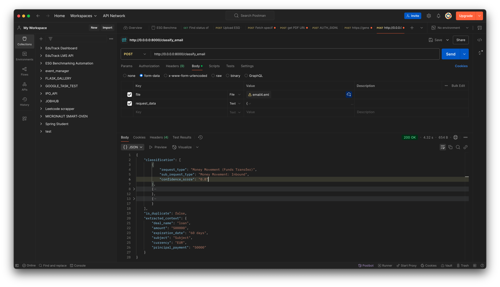
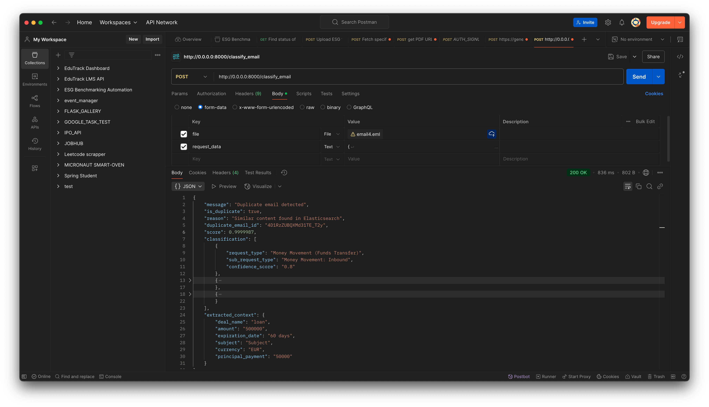
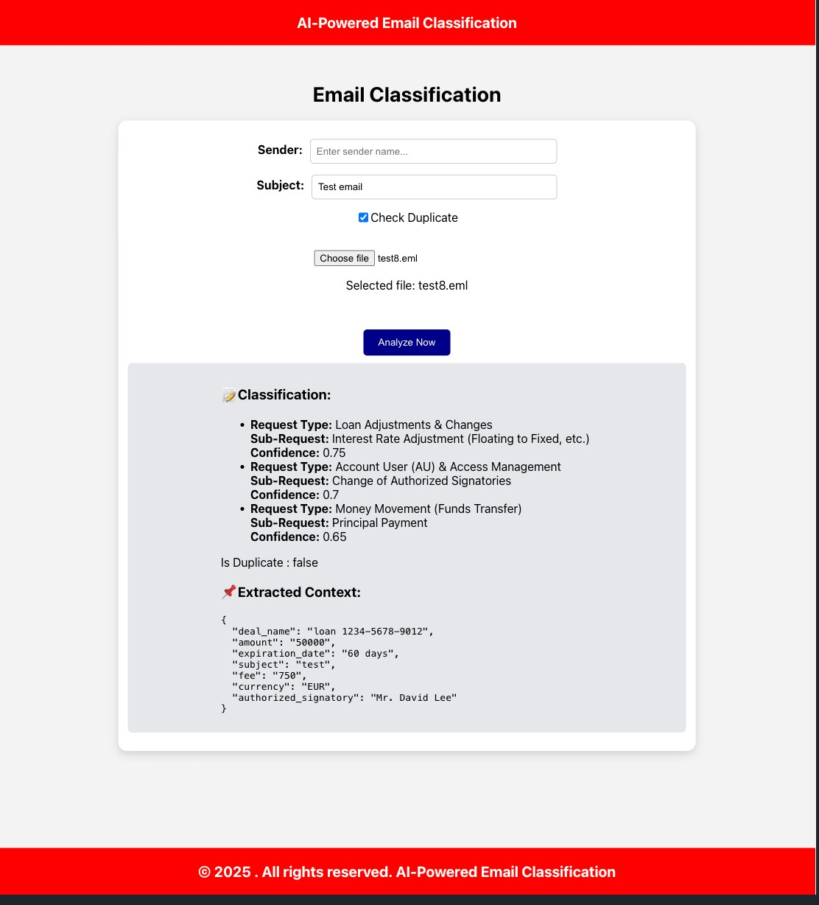
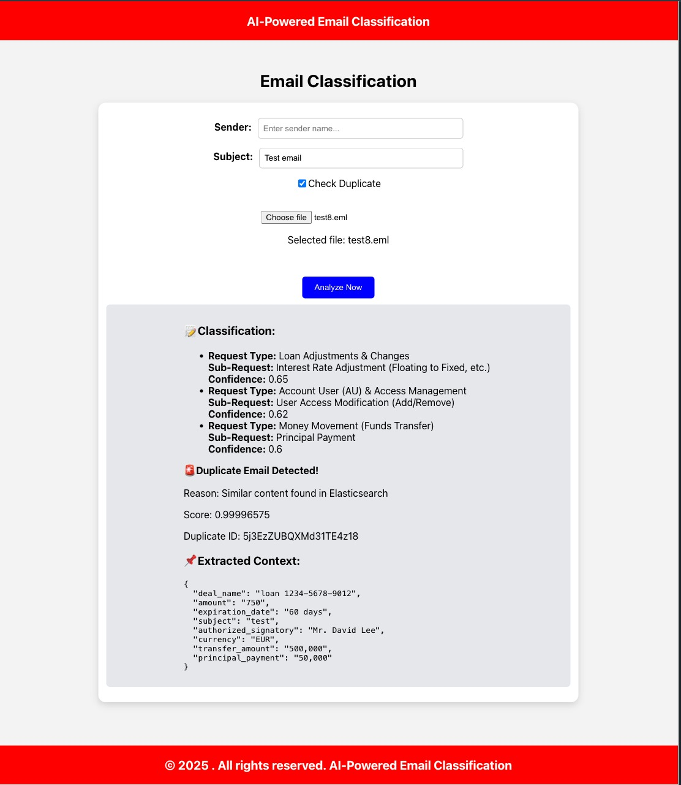

# 🚀 Gen AI based email classification and OCR

## 📌 Table of Contents
- [Introduction](#-introduction)
- [Demo](#-demo)
- [Inspiration](#-inspiration)
- [What It Does](#-what-it-does)
- [How We Built It](#-how-we-built-it)
- [Challenges We Faced](#-challenges-we-faced)
- [How to Run](#-how-to-run)
- [Tech Stack](#-tech-stack)
- [Team](#-team)

---

## 🎯 Introduction
This AI powered tool automates email classification and data extraction using Gen AI LLMs to improve efficiency, accuracy and turnaround time for responding emails and generates classified service requests. Its offering a user interface to end users where they upload the email file, pdf and image files and view the classification response. 

## 🎥 Demo
🔗 [Live Demo](#) (if applicable) 

📹 [Video Demo](artifacts/demo/DemoVideo.MP4)

### 🖼️ Screenshots:

#### API Screenshots: 

Email Classification response:


Email Classification response for a duplicate email:


#### UI Screenshots:

Email Classification:



Duplicate Email Classification:



## 💡 Inspiration
The manual process of data extraction and classification requires a team of gate keepers , is time consuming and prone to human errors. The main objective of this project is to solve this use case of removing human intervention and automate the whole classification process.

## ⚙️ What It Does
1) Content Extraction from email and attachments
2) Perform OCR on images and pdf in attachments
3) Context based data extraction using LLM
4) Detect duplicates by matching the vector embeddings stored in ElasticSearch
5) Classify email using LLM into pre defined request and sub request types
6) Handles multi request email with primary intent identification
7) Priority based extraction where user can define priority rules
8) An user interface where users can upload the emails and see classification response
9) If an email is identified as duplicate and user disputes it as duplicate then they can send another request and it will classify the email

High Level Flow diagram



## 🛠️ How We Built It
1) FastAPI: For building the web API.
2) Uvicorn: For running the FastAPI application.
3) Elasticsearch: For storing email data and performing similarity searches.
4) Google Gemini (GenAI): For text classification and generating embeddings.
5) spacy: For natural language processing tasks.
6) pytesseract: For OCR processing.
PyMuPDF (fitz): For extracting text from PDF files.
7) docx: For extracting text from DOCX files.
8) BeautifulSoup: For HTML content parsing.
9) ReactJS: To build the UI.
10) Postman: To test the Api.
11) Jupyter and VSCode IDE: For developing the project.
12) Canva: For creating the demo video.

## 🚧 Challenges We Faced
We faced initial challange with converting pdf to images to perform OCR. We were using pdf2image python library which was not converting the pdf to images properly.

## 🏃 How to Run
### How to Start the backend server
1. Clone the repository  
   ```sh
   git clone https://github.com/ewfx/gaied-scoeindia.git
   ```
2. Go to src folder
   ```sh
   cd ./code/src
   ```
3. Install dependencies 
   ```sh
   pip install -r requirements.txt
   ```
4. Install spacy and en model
   ```sh
   pip install spacy
   python3 -m spacy download en
   ```
6. Create .env file with following content
   ```sh
   ELASTIC_API_KEY=<API KEY to connect to Elasticsearch cluster>
   GEMINI_API_KEY=<API KEY to connect to Gemini models>
   CLOUD_ID=<CLOUD ID of the Elasticsearch cloud cluster>
   ```
7. Run the project  
   ```sh
   python main.py
   ```
   Application will be up and running on http://0.0.0.0:8000

### How to Start the UI
1. Go to the UI folder
   ```sh
   cd ./UI
   ```
2. Install the node dependencies
   ```sh
   npm i
   ```
3. Start the frontend application
   ```sh
   npm start
   ```
UI will be up and running on http://localhost:5000

## 🏗️ Tech Stack
- 🔹 Frontend: HTML, CSS, React, TypeScript
- 🔹 Backend: Python, FastAPI, Google GenAI, Python SDK
- 🔹 Database: Elasticsearch
- 🔹 Other: Gemini suite of models for GenAI task: LLM - "gemini-2.0-flash", Embeddings model - "text-embedding-004"

## 👥 Team
- **Sparsh** - [GitHub](https://github.com/SparshJain2000) | [LinkedIn](https://www.linkedin.com/in/jain-sparsh/)
- **Ashish** - [GitHub](https://github.com/ashish4321) | [LinkedIn](https://www.linkedin.com/in/ashish1412)
- **Madhurya** - [GitHub](https://github.com/madhurya13wells) | [LinkedIn](https://www.linkedin.com/in/madhurya)
- **Ashwini** - [GitHub](https://github.com/Ashwini19nayak) | [LinkedIn](#)
- **Saraiah** - [GitHub](https://github.com/saraiah-avula) | [LinkedIn](https://www.linkedin.com/in/saraiah-avula-035982206/)
